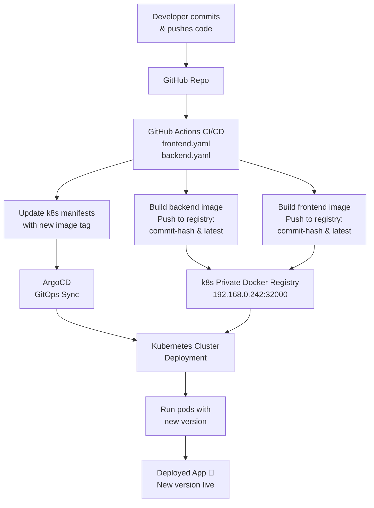

# GarageOS

GarageOS is a personal vehicle operations ledger for tracking charging, fueling, and ownership costs with a FastAPI backend and a Vite + React frontend. The current Phase 0 setup is aligned for a clean database start and initializes PostgreSQL directly from the repository bootstrap schema.

## What this repo contains

- `backend/` — Python backend (entrypoint: `backend/main.py`) and `requirements.txt`.
- `frontend/` — Vite + React frontend application.
- `docker-compose-example.yaml` — example compose setup that wires Postgres, backend and frontend together for local development.
- `docker-compose-dev.yaml` — development-focused compose setup.
- `scripts/smoke-dev.sh` — quick smoke test for the dev Docker Compose environment.
- `k8s/` — Kubernetes manifests (work in progress).
- `sql/` — SQL bootstrap and planning schemas currently in active use.

## Quick start (recommended)

Use Docker Compose from the repository root to run Postgres, the backend and the frontend together.

Example:

```bash
docker compose -f docker-compose-example.yaml up --build
```

Development stack:

```bash
docker compose -f docker-compose-dev.yaml up --build
```

By default the compose example exposes:

- Backend: host port 4646
- Frontend: host port 4242

Notes:

- The compose file uses the following DB credentials: `POSTGRES_USER=ev_user`, `POSTGRES_PASSWORD=ev_password`, `POSTGRES_DB=ev_charger`.
- The database is initialized from `sql/phase0_bootstrap.sql` on first startup.
- If you already have an existing Postgres volume, remove it before expecting the init SQL to run again.
- The frontend receives `VITE_API_URL` via build args / environment.
- The dev compose file now exposes a backend health endpoint at `http://localhost:4646/health` and waits for backend health before starting the frontend.

## Dev smoke test

After the dev stack is up, run:

```bash
bash scripts/smoke-dev.sh
```

This checks:

- Docker Compose service status
- backend health endpoint
- frontend HTTP response
- auth register/login flow
- protected activity endpoint access

## Dev seed data

To load optional demo records for the seeded admin user, run:

```bash
bash scripts/seed-dev.sh
```

This adds idempotent development data for `surmi64@gmail.com`, including:

- demo vehicles
- demo charging and fueling records
- demo insurance and maintenance expenses
- matching `vehicle_events` rows for activity, dashboard, and analytics screens

## Run backend locally (without Docker)

1. Create and activate a Python virtual environment:

```powershell
python -m venv .venv; .\.venv\Scripts\Activate
```

2. Install requirements and run the backend:

```bash
pip install -r backend/requirements.txt

export DB_HOST=localhost
export DB_PORT=5432
export DB_NAME=ev_charger
export DB_USER=ev_user
export DB_PASS=ev_password
export JWT_SECRET_KEY=change-me-locally

uvicorn backend.main:app --host 0.0.0.0 --port 4646 --reload
```

Assumption: the clean database schema has already been applied. The simplest way to get that is the Docker Compose flow above.

## Run frontend locally (without Docker)

1. From the `frontend/` folder install dependencies and start the dev server:

```bash
cd frontend
npm install
npm run dev
```

2. Ensure the frontend is configured to call the backend by setting `VITE_API_URL` to the backend base URL.

```bash
export VITE_API_URL=http://localhost:4646
npm run dev
```

## Build Docker images (optional)

You can build each image manually if you prefer not to use the compose build step:

```powershell
cd backend; docker build -t garageos_backend .; cd ..

cd frontend; docker build -t garageos_frontend .; cd ..
```

## Kubernetes (k8s)

There are manifest stubs in the `k8s/` folder but they are still under development and not ready for production use. For now, use the Docker Compose example for local development. Recommended next steps to finish k8s support:

- Finalize `backend-deployment.yaml` and `frontend-deployment.yaml`.
- Replace in-repo DB with a managed DB or a production-grade Postgres StatefulSet.
- Add Secrets for DB credentials and configure liveness/readiness probes.

## CI/CD Architecture Flowchart


```mermaid
flowchart TD
    dev["`Developer commits
    & pushes code`"]
    repo["GitHub Repo"]
    ci["`GitHub Actions CI/CD
    frontend.yaml
    backend.yaml`"]
    backendBuild["`Build backend image
    Push to registry:
    commit-hash & latest`"]
    frontendBuild["`Build frontend image
    Push to registry:
    commit-hash & latest`"]
    registry["`k8s Private Docker Registry
    192.168.0.242:32000`"]
    manifests["`Update k8s manifests
    with new image tag`"]
    argocd["`ArgoCD
    GitOps Sync`"]
    k8s["`Kubernetes Cluster
    Deployment`"]
    pods["`Run pods with
    new version`"]
    deployed["`Deployed App 🚀
    New version live`"]

    dev --> repo
    repo --> ci
    ci --> backendBuild
    ci --> frontendBuild
    backendBuild --> registry
    frontendBuild --> registry
    ci --> manifests
    manifests --> argocd
    argocd --> k8s
    registry --> k8s
    k8s --> pods
    pods --> deployed
```

## Database bootstrap

- `sql/phase0_bootstrap.sql` is the working clean-start schema used by Docker Compose.
- `sql/dev_seed.sql` is an optional idempotent development data set and is not part of the migration path.
- `sql/target_v3_schema.sql` remains the canonical longer-term schema direction for the planned unified event model.
- Alembic is now available for controlled schema evolution after bootstrap; the baseline migration lives under `backend/alembic/versions/20260402_000001_phase0_baseline.py`.
- Obsolete legacy schema and migration files have been removed from the repository to keep the active DB path unambiguous.

## Database migrations

Install backend dependencies first, then run Alembic from the repository root.

```bash
pip install -r backend/requirements.txt
alembic upgrade head
```

Useful commands:

```bash
alembic current
alembic history
alembic revision -m "describe change"
alembic upgrade head
```

Notes:

- Alembic uses `DB_HOST`, `DB_PORT`, `DB_NAME`, `DB_USER`, and `DB_PASS` when present.
- Without env overrides it defaults to the dev Docker database at `localhost:5435`.
- Inside the backend container use `alembic -c alembic.ini upgrade head` because the container-specific config lives at `backend/alembic.ini` in the repository and `/app/alembic.ini` in the image.
- The current baseline migration defines schema only. Development seed data remains handled separately from migrations.
- Query-pattern indexes are tracked by a follow-up Alembic revision after the baseline so already-initialized databases can converge without recreating the schema.

## Troubleshooting

- If the frontend cannot reach the backend: confirm `VITE_API_URL` matches the backend address and that the backend is reachable from your browser.
- If Postgres does not pick up schema changes in Docker, remove the database volume and start again so `docker-entrypoint-initdb.d` is executed.

## Next steps / TODO

- Finish and validate Kubernetes manifests in `k8s/`.
- Add CI for linting, tests and container image builds.
- Align backend and frontend fully with the canonical target schema.
- Add DB seed data.
- Make container registry persistent
- Make ArgoCD persistent

## License

Repository owner determines licensing; add a LICENSE file if you want this project to be public with a clear license.

---
