# EV Charge Project

A small example project demonstrating a simple EV charging sessions app with a Python backend and a Vite + React frontend. This repository includes Docker tooling and a docker-compose example. Kubernetes manifests are present but still in development.

## What this repo contains

- `backend/` — Python backend (see `backend/app.py`) and `requirements.txt`.
- `frontend/` — Vite + React frontend application.
- `docker-compose-example.yaml` — example compose setup that wires Postgres, backend and frontend together for local development.
- `k8s/` — Kubernetes manifests (work in progress).
- `sql/` — SQL scripts to create database and tables.

## Quick start (recommended)

Use Docker Compose from the repository root to run Postgres, the backend and the frontend together.

In PowerShell:

```powershell
docker-compose -f .\docker-compose-example.yaml up --build
```

By default the compose example exposes:

- Backend: host port 5555
- Frontend: host port 5173 (mapped from container port 80)

Notes:

- The compose file uses the following DB credentials: `POSTGRES_USER=ev_user`, `POSTGRES_PASSWORD=ev_password`, `POSTGRES_DB=ev_charger`.
- The frontend receives `VITE_API_URL` via build args / environment. Adjust this to point at the backend address reachable from the browser.

## Run backend locally (without Docker)

1. Create and activate a Python virtual environment:

```powershell
python -m venv .venv; .\.venv\Scripts\Activate
```

2. Install requirements and run the backend:

```powershell
pip install -r backend\requirements.txt

$env:DB_HOST = 'localhost'; $env:DB_PORT = '5432'; $env:DB_NAME = 'ev_charger'; $env:DB_USER = 'ev_user'; $env:DB_PASS = 'ev_password'

python backend\app.py
```

Assumption: the backend listens on port 5555 by default. If different, adjust `VITE_API_URL` and any port mappings accordingly.

## Run frontend locally (without Docker)

1. From the `frontend/` folder install dependencies and start the dev server:

```powershell
cd frontend; npm install; npm run dev
```

2. Ensure the frontend is configured to call the backend by setting `VITE_API_URL` to the backend base URL. In PowerShell:

```powershell
$env:VITE_API_URL = 'http://localhost:5555'
npm run dev
```

On Windows, setting env vars inline is different than on Unix shells; use the PowerShell pattern shown above.

## Build Docker images (optional)

You can build each image manually if you prefer not to use the compose build step:

```powershell
cd backend; docker build -t ev_backend .; cd ..

cd frontend; docker build -t ev_frontend .; cd ..
```

## Kubernetes (k8s)

There are manifest stubs in the `k8s/` folder but they are still under development and not ready for production use. For now, use the Docker Compose example for local development. Recommended next steps to finish k8s support:

- Finalize `backend-deployment.yaml` and `frontend-deployment.yaml`.
- Replace in-repo DB with a managed DB or a production-grade Postgres StatefulSet.
- Add Secrets for DB credentials and configure liveness/readiness probes.

## CI/CD Architecture Flowchart

```mermaid
flowchart TD
    dev["`Developer commits
    & pushes code`"]
    repo["GitHub Repo"]
    ci["`GitHub Actions CI/CD
    frontend.yaml
    backend.yaml`"]
    backendBuild["`Build backend image
    Push to registry:
    commit-hash & latest`"]
    frontendBuild["`Build frontend image
    Push to registry:
    commit-hash & latest`"]
    registry["`k8s Private Docker Registry
    192.168.0.242:32000`"]
    manifests["`Update k8s manifests
    with new image tag`"]
    argocd["`ArgoCD
    GitOps Sync`"]
    k8s["`Kubernetes Cluster
    Deployment`"]
    pods["`Run pods with
    new version`"]
    deployed["`Deployed App 🚀
    New version live`"]

    dev --> repo
    repo --> ci
    ci --> backendBuild
    ci --> frontendBuild
    backendBuild --> registry
    frontendBuild --> registry
    ci --> manifests
    manifests --> argocd
    argocd --> k8s
    registry --> k8s
    k8s --> pods
    pods --> deployed
```



## Troubleshooting

- If the frontend cannot reach the backend: confirm `VITE_API_URL` matches the backend address and that the backend is reachable from your browser.
- If Postgres fails to initialize in Docker, check container logs and volume permissions.

## Next steps / TODO

- Finish and validate Kubernetes manifests in `k8s/`.
- Add CI for linting, tests and container image builds.
- Add DB migrations (Alembic or similar) and seed data.
- Make container registry persistent
- Make ArgoCD persistent

## License

Repository owner determines licensing; add a LICENSE file if you want this project to be public with a clear license.

---
